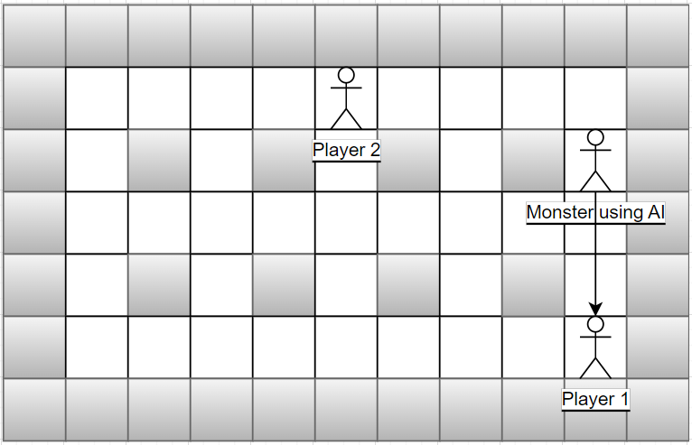

# Bomberman
This is the recreation of the Bomberman in C# implementing the basic AI


This game is using the design pattern:  MVC (Model-View-Controller), State Pattern (used through Finite State Machine)

This game is seperated into 3 parts: Model, Controller, View.
1. Model

This will act as the brain of the game, in which every data of objects is included

2. View

This will run the loop to render the images of objects

3. Controller

This will take the input of keyboard from the users to control the game

MODEL
-----------
This codes are included in the "Entity" class, which is the abstract class for every object. These are to set up the collision detection for every object. 
```php
        public virtual bool GetMoveCollision(List<Entity> list, Rectangle rect)
        {
            return true;
        }
        public virtual List<Entity> GetCollision(List<Entity> list) 
        {
            return list;
        }
        public virtual List<Entity> GetEntityInBounds(List<Entity> list, Rectangle rect)
        {
            List<Entity> InBoundList = new List<Entity>();
            foreach (Entity i in list.ToList())
            {
                if (SplashKit.RectanglesIntersect(i.GetBounds(), rect))
                {
                    InBoundList.Add(i);
                }
            }
            return InBoundList;
        }
        public virtual Rectangle GetBounds()
        {
            Rectangle rect = SplashKit.RectangleFrom(_position.X, _position.Y, _width, _height);
            return rect;
        }
```

"MovableObjects" class is using the following codes that are overriden from the "Entity" class
```php
       public override bool GetMoveCollision(List<Entity> list, Rectangle rect)
        {
            bool collisionable = false;
            foreach (Entity i in GetEntityInBounds(list, rect))
            {
                if (i.GetType() == typeof(Wall) || i.GetType() == typeof(Bomb) || i.GetType().IsSubclassOf(typeof(Monster)) || i.GetType() == typeof(Player))
                {
                    collisionable = true;
                }
            }
            return collisionable;
        }
        public override List<Entity> GetEntityInBounds(List<Entity> list, Rectangle rect)
        {
            List<Entity> InBoundList = new List<Entity>();
            foreach (Entity i in list.ToList())
            {
                if (i.GetBounds().Equals(rect))
                {
                    InBoundList.Add(i);
                }
            }
            return InBoundList;
        }
```

"EntityManager" class would store all the lists of still objects, monsters, players, and entities which store the previous lists
```php
        static List<Entity> stillObjects = new List<Entity>();
        static List<Monster> monsters = new List<Monster>();
        static List<Player> players = new List<Player>();
        static List<Entity> entities = new List<Entity>();
```

In the "Monster" folder, there will be 1 "Monster" abstract class and all monster classes representing for each monster in the game. 

There will also be the "ArtificialBrain" folder that has 2 enumerations for states and triggers(conditions to fire the conditions), 1 main class to control the AI, and 1 subfolder to have all actions to be taken by the monster when in such state. 

The Finite State Machine in this game is using the Stateless library: https://github.com/dotnet-state-machine/stateless

2 states currently done: Attack and Patrol (More are on the way)

The constructor of the "ArtificialBrain" class would take the argument of the type of monster that is using the AI, in this case, "Oneal".

This constructor is initializing the monster object and the finite state machine with all the states and their conditions to be triggered. 
```php
        public ArtificialBrain(Oneal oneal)
        {
            _oneal = oneal;
            machine = new StateMachine<StatesEnum, TriggersEnum>(StatesEnum.Patrol);
            machine.Configure(StatesEnum.Patrol)
                .Permit(TriggersEnum.PlayerWithinRange, StatesEnum.Attack)
                .Ignore(TriggersEnum.PlayerOutOfRange);
            machine.Configure(StatesEnum.Attack)
                .Permit(TriggersEnum.PlayerOutOfRange, StatesEnum.Patrol)
                .Ignore(TriggersEnum.PlayerWithinRange);
        }
```
The conditions of PlayerWithinRange will be met if the method WithinRange() is returning true. 

This method is checking based on 2 cases: South, North and West, East.
As the monster is going to change its direction, so its eyesight will be limited due to its current direction and other objects in the way. 
<p align="center">
  
</p>
<p align="center">
  In this example, as the direction of the monster is towards the south, the monster can only see player 1 and cannot see player 2
</p>


Hence, the progress of checking player being within range of the monster's eyesight is the following: 

1. Checking the current direction of the monster

2. Creating a rectangle with the top left corner coordinates same as the top left coordinates of the monster and spanning to the end of the map in the current direction

3. Checking if are there any objects intersecting and having the same x-coordinate (North or South), or the same Y-coordinate (West or East) with the previously created rectangle (The conditions of having the same X or same Y is to exclude the case that objects are besides the rectangle but are still considered as intersected with the rectangle)

4. The objects that meet the above-mentioned conditions will then be add to the "collidedList".

5. "collidedList" will then be looped through and checked what is the closest object, and if player-type object is the closest object that intersects with the raycasting rectangle from the monster, plus the center-to-center distance from monster to player is less than 48 (2 blocks), withinRange boolean variable will be set to true. 


```php
        public bool WithinRange()
        {
            bool withinRange = false;
            int min = 0;
            Rectangle rect = new Rectangle();
            List<Entity> collidedList = new List<Entity>();
            foreach (Entity i in EntityManager.Entities.ToList())
            {
                if (i.GetType() != typeof(Grass))
                {
                    switch (_oneal.Direction)
                    {
                        case Direction.N or Direction.S:
                            rect = SplashKit.RectangleFrom(_oneal.Position.X, _oneal.Position.Y, 16, 16 * MainView.HEIGHT);
                            if (SplashKit.RectanglesIntersect(i.GetBounds(), rect) && i.Position.X == _oneal.Position.X)
                            {
                                collidedList.Add(i);
                            }
                            foreach (Entity j in collidedList)
                            {
                                min = Math.Abs(collidedList[0].Position.Y - _oneal.Position.Y);
                                int num = Math.Abs(j.Position.Y - _oneal.Position.Y);
                                if (num < min)
                                {
                                    min = num;
                                }

                            }
                            collidedList.Clear();
                            rect = SplashKit.RectangleFrom(_oneal.Position.X, _oneal.Position.Y, 16, min);
                            
                            break;

                        case Direction.W or Direction.E:
                            rect = SplashKit.RectangleFrom(_oneal.Position.X, _oneal.Position.Y, 16 * MainView.WIDTH, 16);
                            if (SplashKit.RectanglesIntersect(i.GetBounds(), rect) && i.Position.Y == _oneal.Position.Y)
                            {
                                collidedList.Add(i);
                            }
                            foreach (Entity j in collidedList)
                            {
                                min = Math.Abs(collidedList[0].Position.X - _oneal.Position.X);
                                int num = Math.Abs(j.Position.X - _oneal.Position.X);
                                if (num < min)
                                {
                                    min = num;
                                }
                            }
                            collidedList.Clear();
                            rect = SplashKit.RectangleFrom(_oneal.Position.X, _oneal.Position.Y, min, 16);
                            
                            break;
                    }
                    if (i.GetType() == typeof(Player))
                    {
                        if (SplashKit.PointPointDistance(SplashKit.RectangleCenter(i.GetBounds()), SplashKit.RectangleCenter(rect)) <= 48)
                        {
                            withinRange = true;
                            if  (_oneal.Position.X == i.Position.X)
                            {
                                if (_oneal.Position.Y > i.Position.Y)
                                {
                                    _oneal.Direction = Direction.N;
                                }
                                if (_oneal.Position.Y < i.Position.Y)
                                {
                                    _oneal.Direction = Direction.S;
                                }
                            }
                            if (_oneal.Position.Y == i.Position.Y)
                            {
                                if (_oneal.Position.X > i.Position.X)
                                {
                                    _oneal.Direction = Direction.W;
                                }
                                if (_oneal.Position.X < i.Position.X)
                                {
                                    _oneal.Direction = Direction.E;
                                }
                            }
                        }
                    }
                }         
            }
            return withinRange;
        }
```

VIEW
----------
This class is to run through the "Entities" list in "EntityManager" class and call the Draw() method for each object. 

```php
        public void Render()
        {
            foreach (Entity i in _entities.ToList())
            {
                i.Draw();
            }
            
        }
```
CONTROLLER
----------
The Update() method of the "GameController" class will be run through every gameloop to check the keyboard input.
```php
        public void Update(List<Entity> list)
        {
            foreach (Player player in _players)
            {
                if (SplashKit.KeyTyped(KeyCode.WKey))
                {
                    player.Direction = Direction.N;
                    player.Move(list);
                }

                else if (SplashKit.KeyTyped(KeyCode.SKey))
                {
                    player.Direction = Direction.S;
                    player.Move(list);  
                }

                else if (SplashKit.KeyTyped(KeyCode.AKey))
                {
                    player.Direction = Direction.W;
                    player.Move(list);
                }

                else if (SplashKit.KeyTyped(KeyCode.DKey))
                {
                    player.Direction = Direction.E;
                    player.Move(list);  
                }

                if (SplashKit.KeyTyped(KeyCode.SpaceKey))
                {
                    player.PutBomb(list);
                }
                player.Die(list);
            }
            foreach(Monster monster in _monsters)
            {
                monster.Die(list);
            }
            
        }
    }
```
